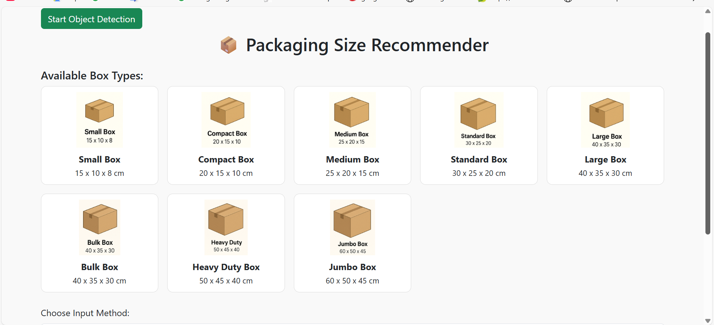
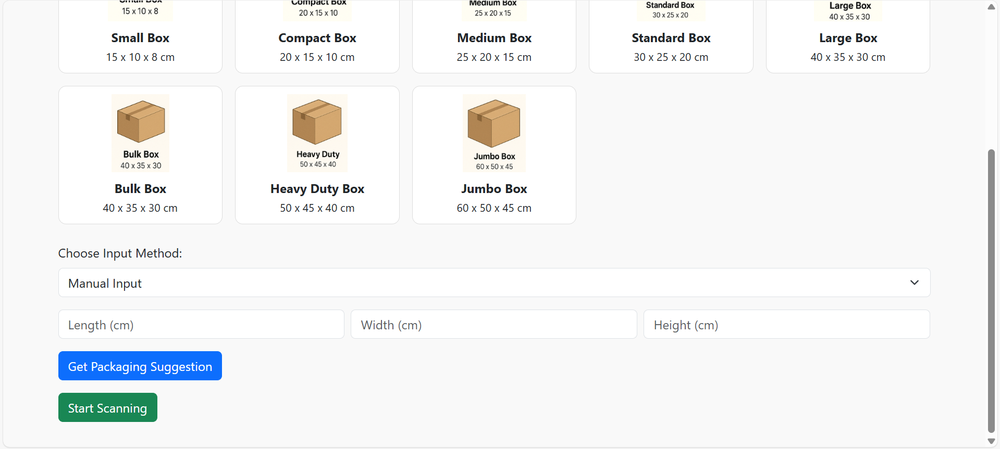
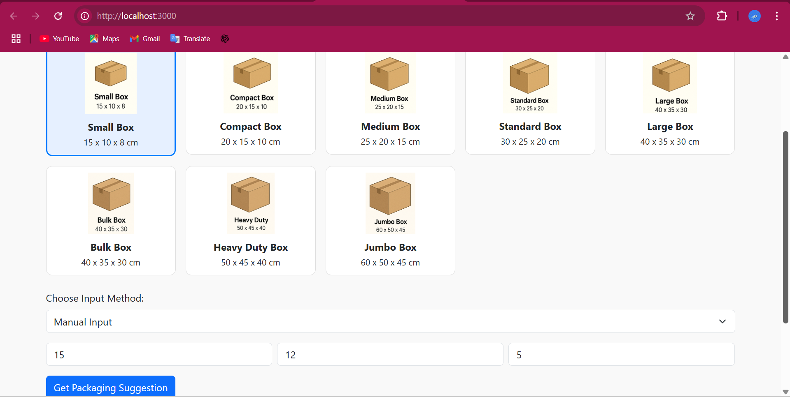
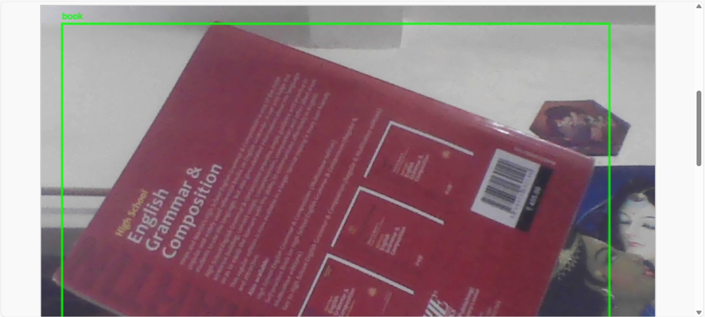
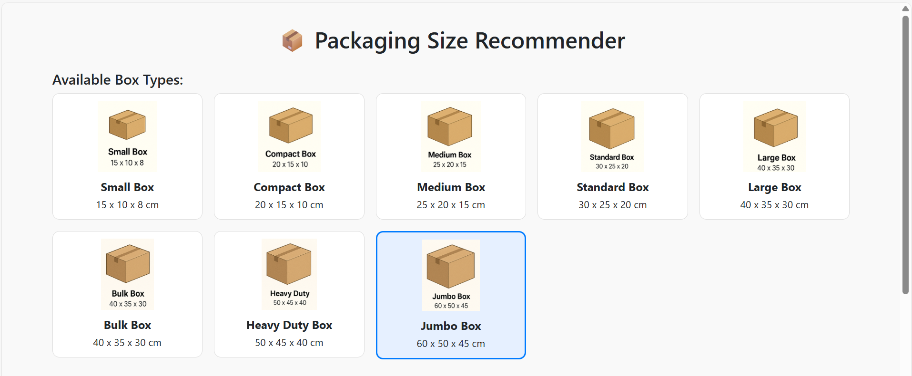

# 📦 Smart Packaging Recommender Tool
A sustainable tool to recommend packaging sizes based on object dimensions or camera input.

🌱 Built under the theme: **"Creating a Sustainable Future"**

---

## 🔧 Features

- 🎯 Suggests appropriate packaging size (Small/Medium/Large)
- 📷 Camera-based object scanning with bounding box (TensorFlow.js)
- ✍️ Manual input of item height, width, and depth
- 🔁 Automatically recommends suitable packaging box
- 🌿 Helps reduce packaging waste for e-commerce companies

---

## 🛠️ Tech Stack

- HTML, CSS, JavaScript
- TensorFlow.js for object detection
- GitHub Pages for deployment (live soon)

---

## 🖼️ Demo (Screenshots)

### 🏠 Homepage Views
| Home Page 1 | Home Page 2 |
|-------------|-------------|
|  |  |

---

### ✍️ Manual Dimension Input

---

### 📷 Object Scanning with Camera

---

### 📦 Final Packaging Box Suggestion

---

## 🚀 How to Run

1. Clone this repo: https://github.com/Saumya2005-dot/smart-packaging-recommender.git
2. Open `index.html` in your browser.
    > Or open directly in the browser once deployed via GitHub Pages.

---

## 💡 Future Enhancements

- Add more box sizes
- Better dimension logic
- Admin dashboard to manage packaging

---

## 👩‍💻 Author

**Saumya Ranjan**  
[LinkedIn](https://www.linkedin.com/in/saumyaranjan-91657428a)  
📧 ranjansaumya357@gmail.com

---
